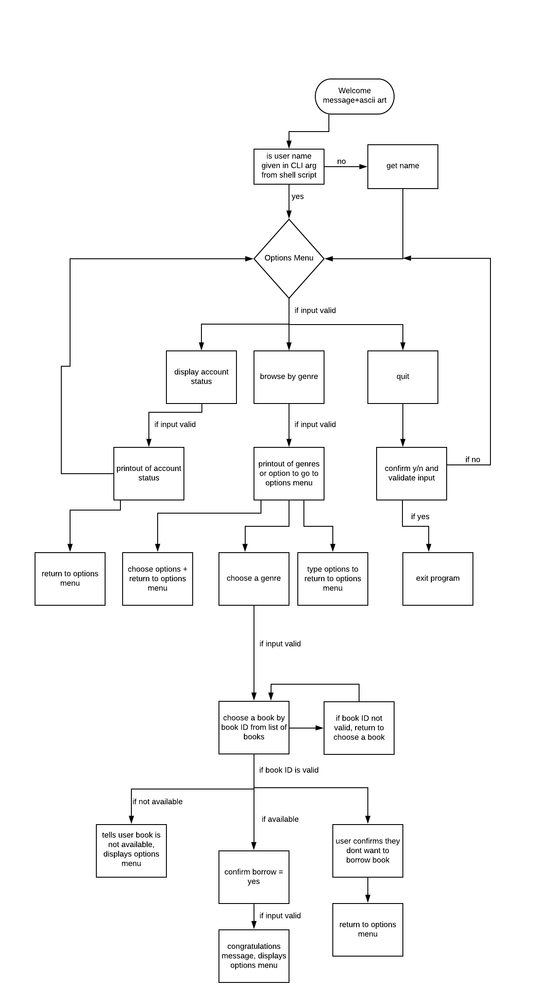

# Software Development Plan

### **Purpose:**

The purpose of this app is for the user to interact with and enjoy browsing a virtual library collection.

The problem this app allows users to solve is unorganised library collections and to enjoy library services.

I am developing it because I love libraries. I am a longtime user of my local library's website and associated apps, so I am familiar with what users need from this kind of service. I would love to work on improving these kinds of public service systems in the future so that everyone has better access to and understanding of library resources. Developing this app is also a great way for me to learn more about Ruby obviously.

The target audience is library users or anyone that loves Ruby terminal apps. Or anyone that loves marking them!

A member of the target audience will use the app by opening the app and following the prompts and navigating the features.

### **Scope:** 

Right now the scope of the app allows users to interact with a menu browse books by genre, choose a book to borrow, borrow a book, and check their account/borrowed books.

I am looking to expand the scope of the app in the future by adding several other features that can be found in my trello board under additional features and in the help file. 

### **Features/User Stories:**

**Navigate Options Menu**

As a user I can see the options menu at key stages throughout the app as listed in the control flow diagram. Option 1 is to view account status, option 2 is to browse books by genre, option 3 is to quit.

**Browse by Genre**

After the user chooses 2 in the options menu, they will be asked to choose a genre to browse. There are currently only 3 genres; Lifestyle, Mystery and History.

**Choose Genre to Browse:**

This feature is implemented after the user is welcomed to the library app, and allows the user to choose from a list of genres supplied by the library app. The genres are printed out with a number below them for the user to choose by number. After the users choose their number that corresponds to their chosen genre, this input is validated. After the user input has been validated to prevent errors, it will output a list of books available to borrow that are part of the chosen genre.

**Choose Book to Borrow:**

This feature allows the user to choose a book to borrow after they have viewed the books within their chosen genre. Similarly to how the user chooses a genre, they will see a list of books to choose from, with each book featuring a title, author and year of publication. Each book will have a book ID which is a number generated by the index position of the book in the library array. The user inputs this book ID to choose a book to borrow. Once they choose a book and this input is validated to prevent errors, they can confirm whether they want to borrow this book or not. If they do they are congratulated, the book is added to their borrowed books for when they want to view their account status, it is marked as currently unavailable in the library, and the user can see the options menu.

**Check Account Status:**

When the user sees the options menu, option 1 is to check their account status. If they choose to, this input is validated to prevent errors, and this outputs a list of details to the terminal: the user's name, their library card number, what books they have borrowed. I would like to add more features to this in future like amount of books left to borrow, late fees, books on hold, return a book etc. The user then can continue on to see the options menu.

**Quit**

Option 3 in the options menu is the quit option. This calls handlequit method which gives the user a last chance whether they want to quit or not. Their input is validated and until it is y or n it loops back to the confirmation question. If y, it exits the app and if n it loops back to options menu.

See the powerpoint for overview of logic in each file.

### **User Interaction and Experience**

The user will find out how to interact with and use each feature after being directly prompted by the program. The user will interact with the program after being prompted by entering numbers to choose a genre, number to choose a book to borrow, y/n when asked to confirm borrowing a book or quitting, etc.

Each step of input will be validated to handle errors(aka choosing genre, choosing book, check account status, navigating options menu), so that if they make the wrong selection (i.e enter a letter instead of a number when choosing genre) the program will prompt them to make the correct input. 

The application is designed to handle errors in a graceful way without breaking the program. The nature of the error will printout so that the user has an idea of what is going wrong and how to fix it (aka make the correct input).

### **Control Flow Diagram**

### **Implementation Plan**

Used trello to plan app flow and features.

https://trello.com/invite/b/kTE7BmL1/9e2de433ba65194f8a8c319e4f264c64/alison-killen-t1a2-implementation-plan

Trello board in progress:

### **Status Updates**

See development log for status updates and daily notes.

### **Testing**

| Feature                                                                      | Expected Outcome                                                                                          | Actual Outcome                                                      | Is it a problem?                                                                                                                                                                                                                                                                                                                                                                                                                                                                                                                                                                                                                       |
|------------------------------------------------------------------------------|-----------------------------------------------------------------------------------------------------------|---------------------------------------------------------------------|----------------------------------------------------------------------------------------------------------------------------------------------------------------------------------------------------------------------------------------------------------------------------------------------------------------------------------------------------------------------------------------------------------------------------------------------------------------------------------------------------------------------------------------------------------------------------------------------------------------------------------------|
| welcome message                                                              | welcomes user to library                                                                                  | as expected                                                         | no                                                                                                                                                                                                                                                                                                                                                                                                                                                                                                                                                                                                                                     |
| ask for user name - when name input from ARGV and running from libraryapp.rb | asks for user name whether running from script or not                                                     | as expected                                                         | user name can currently have integers in it, but not essential to fix for now.                                                                                                                                                                                                                                                                                                                                                                                                                                                                                                                                                         |
| allow user to choose genre                                                   | prints out list of genres with option to choose number to select one                                      | could be formatted nicer                                            | kinda - I would like to have the numbered counter sit exactly beside each genre so it's clear what number correlates to what genre - I was able to do this in an earlier challenge we were given, but havent been able to get it working here. Not essential for now                                                                                                                                                                                                                                                                                                                                                                   |
| output books by genre                                                        | outputs books list in a certain genre after user chooses genre                                            | as expected                                                         | no                                                                                                                                                                                                                                                                                                                                                                                                                                                                                                                                                                                                                                     |
| allow user to choose book                                                    | user chooses book by inputting book id number and confirms whether they want to borrow book               | sometimes allows you to choose gibberish book in lifestyle category | kinda - user originally needed to type the title of book exactly or it will tell them the library doesn't have it -  kinda annoying but fixed this bug with janel by giving each book an ID from its index in the array. BUT current issue is because strings = 0 when converted to integers and the book ID is getting the position of the book object in array. so if you input gibberish when choosing a lifestyle book, it will take it as 0 and as if you are borrowing the first book in that category "breathing". significant bug but for now i will trust that users dont break it and that they enter 0 - needs fixing later |
| colourize gem working                                                        | colourises chosen text                                                                                    | as expected                                                         | no                                                                                                                                                                                                                                                                                                                                                                                                                                                                                                                                                                                                                                     |
| tty-progressbar gem working                                                  | progress bar before viewing account status                                                                | as expected                                                         | no                                                                                                                                                                                                                                                                                                                                                                                                                                                                                                                                                                                                                                     |
| bundler gem working                                                          | bundles gems upon running script                                                                          | as expected                                                         | no                                                                                                                                                                                                                                                                                                                                                                                                                                                                                                                                                                                                                                     |
| ascii art working                                                            | displays book ascii art upon app running                                                                  | as expected                                                         | no                                                                                                                                                                                                                                                                                                                                                                                                                                                                                                                                                                                                                                     |
| command line args working                                                    | user can parse in username from terminal when running script                                              | as expected                                                         | no. this took some refactoring of the library app and the way that it ran as if name was not passed from shell script, it still needed to display art, welcome and get user name so i encapsulated this in a method                                                                                                                                                                                                                                                                                                                                                                                                                    |
| displaying user account details                                              | puts user details including username, library account number, books borrwed (title, author, year, format) | as expected                                                         | no. originally outputted everything ok except for it printed out the book title and author and then prints out the entire book object again after, but this was just because of an unessecary puts statement i identified and fixed                                                                                                                  